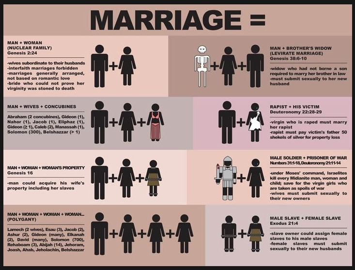

Date: 2012-03-09 
Title: On Splitting Hairs...
Category: Soapbox 
Tags: Speech, Religion
Slug: on-splitting-hairs
Author: Yvan Boily
Summary: "Traditional Marriage" != "Biblical Marriage"... be careful what you ask for!

This probably isn't as constructive as it could be, but arguing that something is or isn't a concern based on multiple definitions of a word is generally ineffective when the root cause of the argument is over the multiple definitions of the word.

*"Without wanting to have the same arguments again (not the point of this
thread), there are two overlapping uses of the verb 'discriminate'."*

and

*"I support the legal definition of marriage which is the voluntary union for life of one man and one woman to the exclusion of all others. I oppose any attempt to redefine it."*

Considering the source for the modern "legal" definition of marriage in most of the "Western World", I think that is far to narrow an attempt to define it.  For the judeo-christian perspective, please consult this handy chart:

[source](http://www.reddit.com/r/reddit.com/comments/hzhmu/how_the_bible_describes_marriage/)
