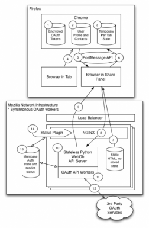
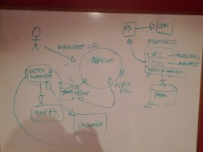
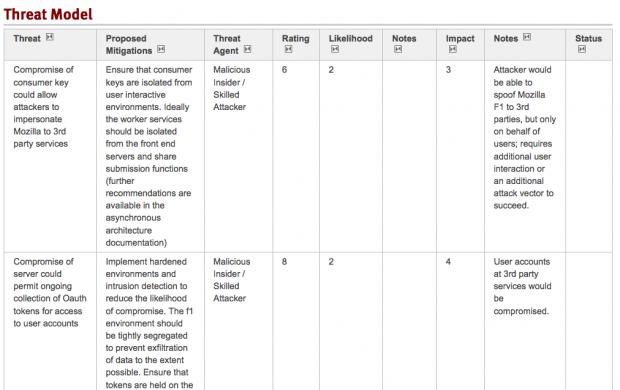

Date: 2012-05-08
Title: Speeding Up Security Reviews
Category: Mozilla
Tags: Community, Security, Crossposts
Author: Yvan Boily

*This post is cross-posted from the [Mozilla Security](https://blog.mozilla.org/security/2012/05/08/speeding-up-security-reviews/) blog.*

At Mozilla we have a strong commitment to [security](http://www.mozilla.org/about/manifesto.en.html#principles); unfortunately due to the volume of work underway at Mozilla we sometimes have a bit of a backlog in getting security reviews done.

Want to speed up your security review request?  You can dramatically increase the turn around time for your security review request by providing the information below.  In addition to this, we are working to expand our overall security review process documentation; you can follow those efforts [here](https://wiki.mozilla.org/Security/ReviewProcess).

## 1. Architecture Diagram

An architecture diagram illustrates how the various components of the service communicate with one another.  This information allows the individual doing the security review to understand which services are required, how and where data is stored, and provides a general understanding of how the application or service works.  Producing an architecture diagram is a good practice as it allows anyone to get a rapid view of how complex a system is, and can inform how much time it will take to work through a review of the system.

### Examples

* [BrowserID Protocol High Level](http://people.mozilla.com/~yboily/identity/assets/images-1/s31.b.jpeg)
* [Apps MarketPlace](https://people.mozilla.com/~ckoenig/App-Marketplace.jpg)

Note that these are just examples; the architecture diagram is intended to help the reviewer visualize what they are assessing.  It doesn’t have to be a fancy diagram, and our team has worked from camera shots of whiteboards from meetings!

##2. Detailed Application Diagram

A Detailed Application Diagram is essentially a Dataflow diagram;  a data flow diagram enumerates each application or service that is a component of a system, and provides a list of the paths that data can flow through.  A dataflow diagram helps the security reviewer to understand how data moves through the system, how different operations are performed, and if detailed enough, how different roles within the system access different operations.

While there are a number of different opinions on the “best way” to do a DFD, it is more helpful to have the information than it is to focus on presenting the information “the right way”.
Examples

* [Mozilla F1 Dataflow Diagram](https://wiki.mozilla.org/images/b/bf/MozillaF1-Diagram.png)
* [BrowserID Detailed Dataflows](https://wiki.mozilla.org/images/2/22/BrowserID-Threat-Model.png)
* [Apps Marketplace](https://people.mozilla.com/~ckoenig/App-Marketplace.jpg)

## 3. Data flow enumeration

An enumeration of data flows in the application explains how and what data moves between various components.  Note that this doesn’t need to be a rigorous explanation of fields; in this case we want a general description of the message, the origin of the message (browser, third party, service, database, etc), the general contents (e.g. “description of the add-on”, “content to be shared”, etc), and a list of sensitive fields.

### Examples

* [BrowserID Dataflow Enumeration](https://wiki.mozilla.org/Security/Reviews/Identity/browserid#1._Provisioning)

4. Threat Analysis
The next step is reviewing all of this information to build out a list of the threats to an application.  The important bit here is that you, as a developer or contributor, know how an application or system works.  You know what a good set of the failure modes of the application are, and you understand the ‘business logic’ of the application.  Many developers have a working knowledge of vulnerabilities, and can identify these types of issues.
In order to properly perform a threat analysis a reviewer needs to understand how the various components of the system work, what threats exist, and be able to identify what mitigating controls have been put into place.
Here is an example of what a threat analysis might look like (links below):

The threat analysis should contain, at a minimum the following information:

* ID – a identifier for the threat
* Title – a concise description of the threat
* Threat – a description of the threat
* Mitigations – a recommendation for a control that can be implemented
* Threat Agent – a list of the potential actors considered that would exploit a vulnerability
* Notes – Related comments that contribute to the analysis, but don’t belong in other columns
* Rating – A qualitative scoring for a vulnerability in the context of this application
* Impact – A qualitative score representing the impact should a vulnerability be exploited
* Likelihood – A qualitative score representing the likelihood of a vulnerability being exploited

Additional information on how we assess and rate threats will be published as part of the documentation for our risk rating and [security review processes)[https://wiki.mozilla.org/Security/Reviews/#Performing_a_Security_Review].
Examples

* [Mozilla F1 Threats](https://wiki.mozilla.org/Security/Reviews/F1#Threat_Model)
* [BrowserID Threats](https://wiki.mozilla.org/Security/Reviews/Identity/browserid#Threat_Model)

Help us help you!

Part of determining the scope of a security review is understanding how an application works and what the risks are; the documentation described in this post helps us to understand this and will ensure that we can complete a security review as quickly as possible.  Beyond that, as teams understand how security reviews are performed it gives them the opportunity to take ownership of security and build it more effectively into their own processes.

As with other Mozilla teams we are actively pursuing better community engagement and always welcome feedback.
